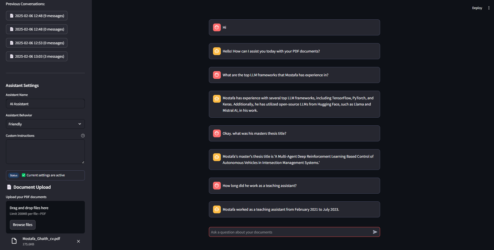

# Agentic RAG PDF Chatbot

<div align="center">


A powerful chatbot application that uses Agentic RAG (Retrieval Augmented Generation) to intelligently answer questions about uploaded PDF documents. The system combines the power of LangChain, OpenAI's GPT models, and vector storage to provide accurate, context-aware responses.

[Features](#features) • [Technology Stack](#technology-stack) • [API Documentation](#api-documentation) • [Setup](#setup--installation) • [Usage](#usage) • [Security](#security)

</div>

## Features

- 📄 PDF Document Upload & Processing
- 💬 Interactive Chat Interface
- 🔍 Intelligent Document Search using RAG
- 🧠 Context-Aware Responses
- 📊 Conversation History Management
- 🎭 Customizable Assistant Personalities
- 🔒 Secure Document Handling
- 🚀 RESTful API Architecture

## Technology Stack

### Backend
- FastAPI - Modern web framework for building APIs
- LangChain - Framework for developing applications powered by language models
- OpenAI GPT-4o - Advanced language model for generating responses
- FAISS - Vector storage for efficient document retrieval
- PyPDF - PDF document processing

### Frontend
- Streamlit - Interactive web interface
- Python Requests - HTTP client for API communication

## API Documentation

The backend provides a RESTful API with the following endpoints:

### Conversation Management

#### Create New Conversation
```http
POST /conversations/new
```
Creates a new conversation session and returns a unique conversation ID.

**Response:**
```json
{
    "conversation_id": "uuid-string",
    "message": "New conversation created successfully"
}
```

#### Upload Documents
```http
POST /conversations/{conversation_id}/upload
```
Upload PDF documents for processing in a specific conversation.

**Parameters:**
- `conversation_id` (path): UUID of the conversation
- `files` (form-data): List of PDF files to upload

**Response:**
```json
{
    "message": "Documents uploaded and processed successfully."
}
```

#### Chat with Documents
```http
POST /conversations/{conversation_id}/chat
```
Send a question and receive an AI-generated response based on the uploaded documents.

**Request Body:**
```json
{
    "question": "Your question here",
    "assistant_name": "AI Assistant",
    "assistant_behavior": "Professional",
    "custom_instructions": ""
}
```

**Response:**
```json
{
    "answer": "AI-generated response based on document context"
}
```

### Additional Endpoints

- `GET /conversations` - List all conversations
- `GET /conversations/{conversation_id}/history` - Get chat history
- `GET /conversations/{conversation_id}/files` - List uploaded files
- `GET /health` - API health check
- `POST /conversations/{conversation_id}/load` - Load conversation documents

## Setup & Installation

1. Clone the repository:
```bash
git clone https://github.com/mostafa-ghaith/agentic-rag-app.git
cd agentic-rag-app
```

2. Set up environment variables:
Create a `.env` file in the root directory with the following variables:
```env
OPENAI_API_KEY=your_openai_api_key
```

3. Using Docker (Recommended):
```bash
docker-compose up --build
```

4. Manual Setup:

Backend:
```bash
cd backend
pip install -r requirements.txt
uvicorn api.main:app --reload
```

Frontend:
```bash
cd frontend
pip install -r requirements.txt
streamlit run app.py
```

## Usage

1. Access the web interface at `http://localhost:8501`
2. Upload PDF documents using the sidebar
3. Set the custom behaviour of the chatbot as wanted (Optional)
4. Start chatting with the bot about your documents
5. Clear conversations using the "Clear Conversation" button

<div align="center">

### Chatbot Interface


*Interactive chat interface with document upload and customizable assistant behavior*

</div>

## Development

To contribute to the project:

1. Fork the repository
2. Create a feature branch
3. Make your changes
4. Submit a pull request

## Security

- API keys and sensitive data are managed through environment variables
- Document storage is temporary and session-based
- Secure file handling and validation
- Rate limiting on API endpoints
- Input sanitization and validation
- CORS policy implementation
- Regular security updates and dependency scanning

## License

MIT License

Copyright (c) 2025 Mostafa Ghaith


## Contact

Mostafa Ghaith\
linkedin.com/in/mostafa-ghaith\
github.com/mostafa-ghaith